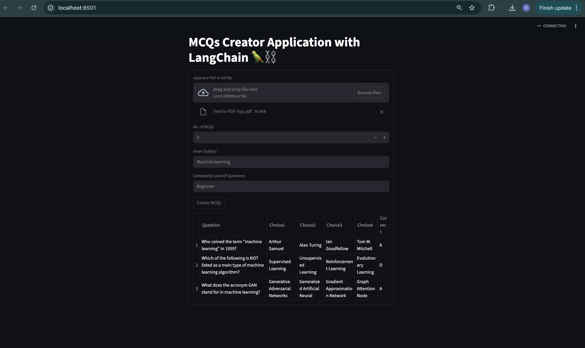

# 📝 MCQ Generator Application using LangChain & Groq

An end-to-end **AI-powered MCQ Generator** that automatically creates high-quality multiple-choice questions from **PDF or text files** using **LangChain**, **Groq LLMs**, and **Streamlit**.

This project demonstrates real-world usage of **LLMs, prompt engineering, structured output parsing, and UI integration**.

---

## 🚀 Features

- 📄 Upload **PDF or TXT** files
- 🤖 Generate MCQs using **Groq LLM**
- 🎯 Subject-specific & difficulty-aware questions
- 🧠 Beginner-friendly MCQs
- 📊 MCQs displayed in a **structured table**
- 📁 Output easily convertible to **CSV**
- ⚡ Fast inference using **Groq**
- 🧩 Built with **LangChain Runnable pipelines**
- 🖥️ Interactive UI using **Streamlit**

---

# 📝 How to Run the Project

This guide explains **step-by-step** how to clone, set up, and run the **MCQ Generator Application** on your local machine.

No prior LangChain or Groq experience required.

---

## 📌 Prerequisites

Make sure you have the following installed:

- ✅ **Python 3.10 or above**
- ✅ **Git**
- ✅ A **Groq API Key**

---

## 📥 Step 1: Clone the Repository

```bash
git clone https://github.com/renuvishwakarmatech-code/MCQ_Generator.git
cd MCQ_Generator
```

## 🔑 Step 2: Create a Virtual Environment

It is strongly recommended to use a virtual environment to avoid dependency conflicts.

### macOS / Linux
```bash
python3 -m venv mcq_gen_env
source mcq_gen_env/bin/activate
```

### Windows
```bash
python -m venv mcq_gen_env
mcq_gen_env\Scripts\activate
```

## 🔑 Step 3: Install Project Dependencies
```bash
pip install --upgrade pip
pip install -r requirements.txt
```

## 🔑 Step 4: Add Environment Variables (.env)
```bash
touch .env
GROQ_API_KEY=your_groq_api_key_here
```

## 🔑 Step 5: Run the Streamlit Application
```bash
streamlit run StreamlitAPP.py
```

## 🖼️ Application Screenshot

